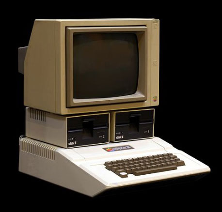
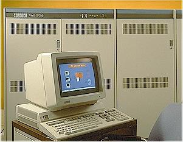
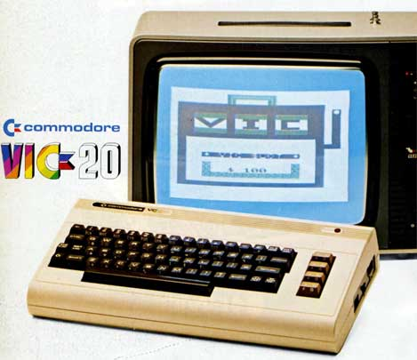

# Notas para la Entrevista alumnos Andrés Bello sobre Estudios de Informatica

## Preguntas que deseamos plantear a ambos entrevistados

* Resulta evidente que los equipos informáticos de hoy en día son muy diferentes a aquellos primeras computadoras personales de finales de los setenta o principios de los ochenta. ¿Ha notado usted una evolución parecida en el hardware de los ordenadores con los que ha trabajado?

  
* ¿Cree que se ha producido también esa misma evolución en el software?

   * Por supuesto, pero no tanto!: lenguaje máquina, ensamblador, FORTRAN, Lisp, C como ensamblador hoy en día, SmallTalk, ...
   * Lenguajes dinámicos: Perl, Python, Ruby, Node, javaScript, etc.
   * Lenguajes de I.A: Prolog, etc.
   * Sistemas Operativos mas sofisticados, pero no tanto!: Linux, Android, IOS, OS X, etc. comparados con los antiguos Unix, Vax VMS, CP/M, MsDos etc.

* Muchos estudiantes plantean preguntas similares a las siguientes ¿Cómo fueron sus primeros contactos con la Informática? ¿Recuerda a su primer ordenador? ¿Lo conserva?

 

 

 

 

 

 

  * El Apple II por dentro:

    * https://youtu.be/ESDANSNqdVk

* ¿Suele alargar la vida útil de sus equipos personales actualizándolos o prefiere adquirir la última tecnología?

* ¿Utiliza habitualmente el móvil o una tablet para navegar en Internet o utilizar las redes sociales?

* ¿Utiliza o ha utilizado videoconsolas? ¿Tiene predilección por alguna? ¿Algún videojuego?

  * https://youtu.be/yYoRCcwwfO4
  * https://youtu.be/VBiWg9Xoa2c
  * Tetris

* ¿Tuvo muchas dudas para decidir que carrera universitaria quería realizar? ¿Qué le motivó a seguir esos estudios?

  *  No tuve mas remedio

* Después de obtener su titulación ¿Le fue fácil conseguir ofertas de trabajo? ¿Que le llevó a trabajar en este sector?

* ¿Qué opina de las iniciativas de enseñar programación y robótica en Primaria?

   * Es el momento de empezar. 
   * La forma en la que se aborda haciendo uso de un ordenador la resolución de problemas.  
   * [Computer Science Unplugged](http://csunplugged.org/)
   * La forma de pensamiento es lo importante: Pensamiento Algoritmico.
   * Es el futuro: ** TIENEN QUE TENER LAS HERRAMIENTAS DE PENSAMIENTO ** para poder sobrevivir en el mundo que viene

* Además de aprender a programar visualmente en entornos como Scratch. ¿Recomendaría algún lenguaje de programación en particular?

    * An hour of Code: [https://code.org/](https://code.org/)
    * [Computer Science Unplugged](http://csunplugged.org/)
    * [App Inventor](http://appinventor.mit.edu/explore/)
    * Lego Mind Storms
    * Raspberry Pi
    * [Alice](http://www.alice.org/index.php)
    * Lenguajes de programación convencionales: 
        * JavaScript, HTML, CSS, Node, ...
        * Java, 
        * Ruby, 
        * Python, 
        * C, 
        * C++, etc.

* En su opinión ¿qué características debiera tener un estudiante de bachillerato para tener éxito en los estudios de ingenierías?

Tiene que tener:

   * Iniciativa
   * Disciplina
   * Capacidad de abstracción
   * Curiosidad
   * Imaginación
   * Capacidad de Observación
   * Capacidad de Análisis

<!--

### Preguntas dirigidas a D. José Mª Carralero

¿Cuántas personas trabajan en el Centro de Cálculo?

¿Qué tareas y actividades realiza habitualmente? ¿A cuáles les dedica más atención?

¿A cuántos centros universitarios y usuarios dan servicio?

¿Cuál es el ordenador más potente del Centro de Cálculo? ¿Qué características tiene? ¿En qué se utiliza?

Sabemos que en Tenerife se encuentra el segundo superordenador de España, el Teide-HPC. ¿Utiliza la Escuela Superior de Ingeniería y Tecnología sus servicios?

¿Utiliza habitualmente Software Libre? ¿Qué lenguajes de programación suele utilizar?

¿Qué nuevos avances tecnológicos cree que tendrán una mayor repercusión en los próximos años?

¿Desea aprovechar esta entrevista para trasladarnos alguna otra información u opinión?

-->

## Preguntas dirigidas a D. Casiano Rodríguez

* En su opinión, ¿Qué sectores económicos de la isla ofrecen más puestos de trabajo a titulados en informática?

  * Trabajo remoto: Papalardo, Raimon Grau, etc. 
  * Aplicaciones Web 
  * Aplicaciones para smart phones
  * Los consumidores de servicios informáticos mas importanes son el Gobierno y las Adminsitraciones, las cuales normalmente externalizan sus necesidades de manera que son empresas privadas externas las que proveen los servicios que las diferentes administraciones demandan. 
  * Empresas como ATOS, INDRA programadores en desarrollo de proyectos: ganan los concursos de las administraciones del estado
  * En las administraciones suelen trabajar equipos mas pequeños que se encargan entre otras cosas del control de los servicios y proyectos realizados por las empresas informáticas
  * Otras son las empresas privadas; no hay que olvidar aquí al turismo
  * Enseñanza: módulos de FP
  * PERO la mayor parte del empleo y de las empresas de interés se encuentran fuera: muchos de nuestros ex-alumnos están en Londres, Madrid, Barcelona, Dublín, Alemania, Ginebra, California, ...

* ¿Cuántos estudiantes del grado de informática suelen acogerse anualmente a proyectos de movilidad Erasmus? ¿Qué países suelen elegir?

   * Véase [Movilidad Internacional en la ETSII](http://www.ull.es/view/centros/etsii/Movilidad_Internacional/es)
   * Reino Unido
   * Irlanda
   * Suecia
   * Holanda
   * Alemania
   Este año no salió nadie y vinieron dos. Para el curso que viene hay solicitadas dos para salir.

   

* ¿Recibe la Escuela Superior de Ingeniería y Tecnología muchos estudiantes Erasmus?

   * Este año no salió nadie y vinieron dos. Para el curso que viene hay solicitadas dos para salir.
   * [Comisión de Movilidad](https://campusvirtual.ull.es/facultades/course/view.php?id=120)
   * Erasmus, SICUE ( Sistema de Intercambio entre Centros Universitarios de España), extracomunitarios, profesores y alumnos
   * Acreditación de Idioma
   * Nota mínima 

* ¿Se imparte alguna materia del grado en inglés?
   * Asignaturas de Inglés
   * Un porcentaje de las Asignaturas de Itinerario
   * Parte de la exposición Trabajo fin de Grado
   * 12 créditos de Inglés gobierno de canarias: 6 en la asignatura de inglés y los otrs 6 repartidos entre todas las de itinerario

* ¿Hay más alumnos que alumnas en los estudios del grado?

  * En todos los grados 575 mujeres y 43% hombres
  * En educacion infantila 94% mujeres y 6% hombres
  * En informatica 15% mujeres y 85% hombres
  * En civil 34% mujeres y 66% hombres
  * quimica  72% hombres y 28%mujeres
  *  electronica industrial y automatica 15% mujeres y 85% hombres

* ¿Ha estado o está involucrado actualmente en algún proyecto compartido con centros o empresas de otros países?

   * Gara es representante Española del proyecto [COST](http://www.cost.eu/). Proyecto Europeo para la creación de redes de movilidad. 
   * Eduardo ->  Universad Napier de Edimburgo
   * Carlos: En CIMAT. Centro de investigación matemática en Guanajuato, Mexico.

* ¿Nos puede hablar un poco de su labor como investigador?

   * Algoritmos Heurísticos
   * Evolutivos, genéticos, 
   * Aplicaciones: Resolucion de problemas de telecomunicaciones, posicionamiento de antenas, asignación de frecuencias, resolucion ajuste de parámetros de redes inalámbricas, corte y empaquetado: bidimensional con guillotina, carga de contenedores, clasificador brain computer interfaces

* ¿Cree que la instalación en Tenerife del superordenador Teide-HPC facilitará el desarrollo de proyectos de investigación en la Universidad de La Laguna?

   * Proyecto/Convenio con el ITC Teide-HPC
   * Simulación de problemas como los que hacemos
   * Simular experimentos de algoritmos evolutivos con distintos parámetros, hacemos evolucionar el algoritmos muchas generaciones.

* ¿Qué consejo o recomendación le daría a un estudiante de Bachillerato que estuviera pensando realizar los estudios de grado en ingeniería informática?

  * Iniciarse en la Programación
  * La programación de Juegos y Videojuegos motiva mucho
  * Buenos conocimentos de matemáticas: algebra, cálculo, geometría, optimización 

* ¿Desea aprovechar esta entrevista para trasladarnos alguna otra información u opinión?

   * El País: [El futuro será de los jóvenes 'navaja suiza'](http://economia.elpais.com/economia/2015/12/11/actualidad/1449864531_685393.html): * “En 2030, el 50% de las profesiones serán de nueva creación y se buscará gente que sepa trabajar en equipo en entornos virtuales”*
